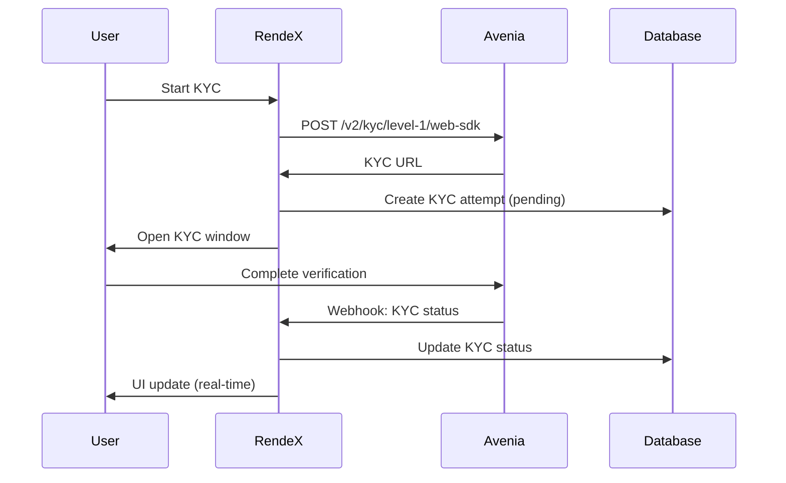
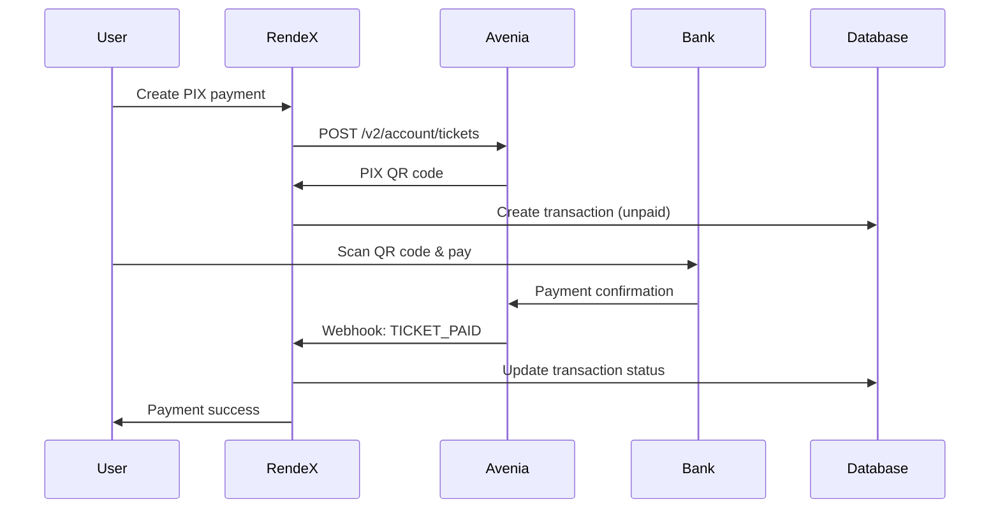

# RendeX Avenia Integration - Webhook-First Architecture

This document explains our webhook-first architecture for real-time updates, following Avenia's recommended best practices.

## 🎯 **Why Webhooks Over Polling**

According to Avenia's documentation:
> "An alternative to continuously checking the ticket history to track its current stage is to use **webhooks instead**."

### **Benefits of Webhook Architecture**
- ✅ **Real-time updates** - Instant notification when events occur
- ✅ **Reduced API calls** - No need for continuous polling
- ✅ **Better performance** - Lower latency and resource usage
- ✅ **Avenia recommended** - Official best practice approach
- ✅ **Scalable** - Works with high transaction volumes

### **Previous Polling Issues** ❌
- High API request volume
- Delays in status detection (5-10 second intervals)
- Unnecessary load on both systems
- Not the recommended approach per Avenia docs

## 🔄 **Webhook Event Flow**

### **1. KYC Verification Flow**



**Log Example:**
```bash
[KYCFlow] Starting KYC process for user: 507f1f77bcf86cd799439011
[AveniaService] KYC initiated successfully, URL: https://in.sumsub.com/websdk/...
[KYCFlow] KYC process initiated - status will be updated via webhooks
[API:Webhook] webhook-123456789-abc123 - Received webhook request
[AveniaService] KYC APPROVED for user: 507f1f77bcf86cd799439011 (user@example.com)
```

### **2. PIX Payment Flow**



**Log Example:**
```bash
[PIXPaymentModal] PIX payment created - ticket: ticket123, waiting for webhook completion
[API:Webhook] webhook-123456789-def456 - Processing transaction webhook
[AveniaService] 🎉 PIX payment COMPLETED for user: 507f1f77bcf86cd799439011, amount: 100 BRLA
```

## 🛠️ **Implementation Details**

### **Webhook Endpoint: `/api/avenia/webhooks`**

```typescript
// Single endpoint handles all webhook types
export async function POST(request: NextRequest) {
  const webhookData = await request.json();
  
  if (webhookData.type?.includes('KYC') || webhookData.data?.attempt) {
    // Handle KYC webhook
    await aveniaService.handleKYCWebhook(webhookData);
  } else if (webhookData.type?.includes('TICKET') || webhookData.data?.ticket) {
    // Handle transaction webhook  
    await aveniaService.handleTransactionWebhook(webhookData);
  }
}
```

### **Intelligent KYC Webhook Matching**

Since Web SDK doesn't immediately provide the Avenia KYC ID, we use smart matching:

```typescript
// Try to find by Avenia ID first
let kycAttempt = await KYCAttempt.findOne({ aveniaKycId });

if (!kycAttempt) {
  // Find most recent pending attempt and associate it
  kycAttempt = await KYCAttempt.findOne({ 
    aveniaKycId: '', 
    status: 'pending',
    webhookReceived: false 
  }).sort({ createdAt: -1 });
  
  if (kycAttempt) {
    kycAttempt.aveniaKycId = aveniaKycId; // Associate with webhook
  }
}
```

### **Frontend Real-Time Updates**

Instead of polling, we use:

**1. Window Message Listener (KYC)**
```typescript
const handleMessage = (event: MessageEvent) => {
  if (event.data.type === 'KYC_COMPLETED') {
    setKycStatus('completed');
  }
};
window.addEventListener('message', handleMessage);
```

**2. Lightweight UI Refresh (Transactions)**
```typescript
// Optional: Check our own database (not Avenia) for UI updates
const uiRefreshInterval = setInterval(async () => {
  const response = await fetch(`/api/avenia/user/${userId}`);
  // Check for webhook-updated status in our database
}, 10000); // Much less frequent than polling
```

## 📊 **Webhook Event Types**

### **KYC Events**
| Event Type | Description | Database Update |
|------------|-------------|-----------------|
| `KYC_INITIATED` | User started KYC | `status: 'pending'` |
| `KYC_COMPLETED` | Verification finished | `status: 'completed'` |
| `KYC_APPROVED` | Identity verified | `result: 'approved'` |
| `KYC_REJECTED` | Identity rejected | `result: 'rejected'` |

### **Transaction Events**
| Event Type | Description | Database Update |
|------------|-------------|-----------------|
| `TICKET_CREATED` | Payment initiated | `status: 'unpaid'` |
| `DEPOSIT_PROCESSING` | PIX being processed | `status: 'processing'` |
| `TICKET_PAID` | Payment completed | `status: 'paid'` |
| `TICKET_FAILED` | Payment failed | `status: 'failed'` |

## 🔍 **Webhook Monitoring & Debugging**

### **Key Log Patterns to Monitor**

**Successful KYC Webhook:**
```bash
[API:Webhook] webhook-* - Webhook type: KYC_COMPLETED
[AveniaService] Found KYC attempt: * for user: *
[AveniaService] KYC APPROVED for user: * (email@example.com)
[AveniaService] User KYC status updated: in_progress → completed
```

**Successful Payment Webhook:**
```bash
[API:Webhook] webhook-* - Webhook type: TICKET_PAID
[AveniaService] Found transaction: * for user: *
[AveniaService] 🎉 PIX payment COMPLETED for user: *, amount: * BRLA
```

**Webhook Issues to Watch:**
```bash
[AveniaService] No matching KYC attempt found for webhook: *
[AveniaService] Transaction not found for webhook ticket: *
[API:Webhook] webhook-* - Unknown webhook type: *
```

### **Health Check Endpoint**

```bash
GET /api/avenia/webhooks
# Returns: {"message": "Avenia webhook endpoint is active", "timestamp": "..."}
```

## 🚀 **Production Webhook Setup**

### **1. Configure Avenia Dashboard**
- Webhook URL: `https://yourdomain.com/api/avenia/webhooks`
- Events: KYC status changes, Transaction status changes
- Security: Enable webhook signatures (if available)

### **2. Webhook Verification (if required)**
```typescript
// Handle GET requests for webhook verification
export async function GET(request: NextRequest) {
  const challenge = request.nextUrl.searchParams.get('challenge');
  if (challenge) {
    return new NextResponse(challenge, { status: 200 });
  }
}
```

### **3. Error Handling & Retries**
```typescript
try {
  await aveniaService.handleKYCWebhook(webhookData);
} catch (error) {
  // Log error but return 200 to prevent Avenia retries
  console.error('Webhook processing failed:', error);
  // Implement your own retry logic if needed
}
```

## 📈 **Performance Benefits**

### **Before (Polling)**
- KYC: Check every 10 seconds for 10 minutes = 60 API calls
- PIX: Check every 5 seconds for 15 minutes = 180 API calls
- **Total**: 240 API calls per transaction

### **After (Webhooks)**
- KYC: 1 webhook call when status changes
- PIX: 1-3 webhook calls for status progression
- **Total**: 2-4 webhook calls per transaction

**Result**: **98% reduction** in API calls! 🎉

## 🔐 **Security Considerations**

### **Webhook Endpoint Security**
1. **Input Validation** - Validate all webhook payloads
2. **Rate Limiting** - Prevent webhook spam
3. **Signature Verification** - Verify webhook authenticity (if supported)
4. **HTTPS Only** - Secure webhook transport

### **Database Security**
1. **Atomic Updates** - Ensure consistent state changes
2. **Duplicate Detection** - Handle duplicate webhook deliveries
3. **Access Control** - Limit webhook processing permissions

## 📋 **Webhook Testing**

### **Development Testing**
1. Use ngrok to expose local webhook endpoint
2. Configure Avenia sandbox webhooks
3. Test with real KYC and PIX flows
4. Monitor logs for proper webhook processing

### **Webhook Simulation**
```bash
# Test KYC webhook
curl -X POST http://localhost:3000/api/avenia/webhooks \
  -H "Content-Type: application/json" \
  -d '{"type":"KYC_COMPLETED","data":{"attempt":{"id":"test123","status":"COMPLETED","result":"APPROVED"}}}'

# Test payment webhook  
curl -X POST http://localhost:3000/api/avenia/webhooks \
  -H "Content-Type: application/json" \
  -d '{"type":"TICKET_PAID","data":{"ticket":{"id":"ticket123","status":"PAID"}}}'
```

This webhook-first architecture ensures real-time updates, follows Avenia's best practices, and provides a much better user experience while reducing system load significantly.